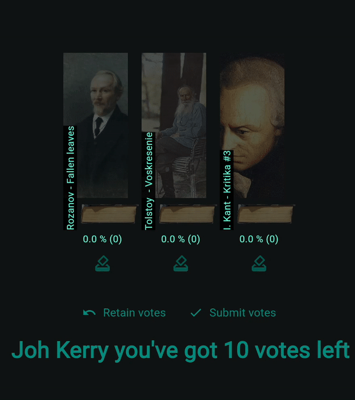

# And the winner is .. App!

This is a demo of ➤ **Telegram Mini App**. It was made for my reading group so we could vote on the next book to read without leaving Telegram — and since Telegram doesn't support cumulative polls, I built this as a custom solution. 
This is my first attempt at frontend development.
## Stack:
-   **Frontend:** Flutter (with custom Rive animations)
    
-   **Backend:** Python with FastAPI, SQLAlchemy, Pydantic, and Alembic
    
-   **Infrastructure:** Docker + Postgres + Alembic migrations

## Run it! 
`docker compose up --build`

## Frontend

 - Flutter app with custom Rive animation for polls. 
 - Telegram login support is built-in, but disabled by default for demo purposes (you
   can enable it by configuring your `.env` file).

## Backend

 - FastApi + pydantic + SqlAlchemy + alembic.
 - 3-layer architecture (api-service-repository).
 - Uses Alembic migrations for creating table schemas and inserting initial data (demo poll).

  
